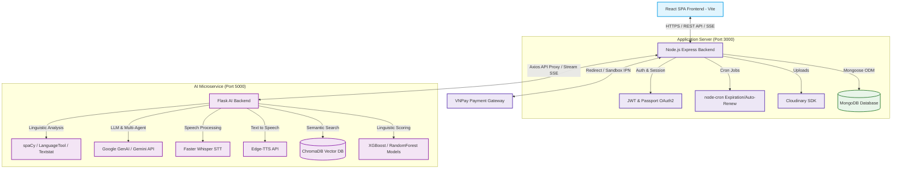

# 🎓 IELTS Learning & Practice Platform - Hệ thống ôn luyện IELTS tích hợp Trí tuệ Nhân tạo (Hybrid AI & Multi-Agent)

[](https://github.com/phuccka12/DoanThuctap)
[](https://mongodb.com)
[](https://ai.google.dev)
[](https://opensource.org/licenses/ISC)
[](#)

---

## 🌟 Giới Thiệu Chung

Đây là dự án **Đồ án tốt nghiệp** xây dựng một nền tảng học và luyện thi IELTS thông minh, toàn diện, ứng dụng các mô hình học máy học (Machine Learning) và trí tuệ nhân tạo tạo sinh (Generative AI). Dự án giải quyết các vấn đề cốt lõi của người học IELTS thông qua việc cá nhân hóa lộ trình học tập, chấm điểm tự động kỹ năng Nói/Viết theo tiêu chuẩn IELTS Band Score, học từ vựng qua ngữ cảnh câu chuyện, dịch ngược và kết hợp các cơ chế trò chơi hóa (Gamification) để kích thích động lực học tập liên tục.

### 🚀 Điểm Nhấn Công Nghệ
- **Hệ thống Multi-Agent Content Engine:** Tự động sinh tài liệu học thuật theo tiêu chuẩn châu Âu (CEFR) qua cơ chế tự sửa đổi và phê duyệt (Self-Correction Loop).
- **Đánh Giá Speaking/Writing Lai (Hybrid AI):** Kết hợp phân tích ngôn ngữ học từ thư viện NLP (spaCy, LanguageTool, textstat) kết hợp với các mô hình Generative AI (Google Gemini) để chấm điểm chính xác và cung cấp bài mẫu chi tiết.
- **Cá nhân hóa Lộ trình Học tập (Roadmap Adaptive):** Thiết kế bài kiểm tra đầu vào (Placement Test), phân loại năng lực để sinh ra lộ trình học cá nhân hóa (`UserPlan`) riêng biệt cho từng người dùng.
- **Trò chơi hóa Nuôi thú ảo (Virtual Pet Ecosystem):** Kết nối trực tiếp kết quả học tập của người dùng với sự phát triển và trạng thái của Pet ảo (sử dụng EXP Multiplier, Coin Economy).

---

## 🏗️ Kiến Trúc Hệ Thống (System Architecture)

Dự án được xây dựng dựa trên kiến trúc **3-Tier Multi-Service** giúp tách biệt giao diện, logic nghiệp vụ ứng dụng và các mô hình tính toán AI nặng:



---

## 🛠️ Bản Đồ Tính Năng Chi Tiết (Feature Matrix)

### 1. 🎤 Luyện Nói Thông Minh (AI Speaking Practice & Conversation)
*   **Chấm điểm Speaking theo thời gian thực (Streaming Evaluation):** Nhận diện giọng nói của học viên qua **OpenAI Whisper (Faster-Whisper)**, phân tích và chấm điểm độ trôi chảy (Fluency), ngữ pháp (Grammar), từ vựng (Vocabulary) và cách phát âm.
*   **Hội thoại Tương tác AI (AI Conversation):** Tạo môi trường giao tiếp 1-1 giả lập với giáo viên bản xứ. Hệ thống phản hồi tức thì bằng giọng đọc tự nhiên (tích hợp **Edge-TTS** với nhiều lựa chọn accent Anh-Anh, Anh-Mỹ).
*   **Nhật ký phát triển:** Đồng bộ điểm số trực tiếp với Tiến độ Lộ trình (`LessonProgress`) và tặng thưởng Coin/EXP.

### 2. ✍️ Chấm Bài Viết Chuyên Sâu (AI Writing Evaluation PRO)
*   **Hệ thống chấm Async Task Queue:** Đảm bảo độ ổn định cao, trả về ID và thông báo trạng thái chấm bài để tránh timeout trình duyệt.
*   **Chi tiết Phản hồi (Linguistic Feedback):**
    *   Phát hiện các lỗi chính tả, ngữ pháp cụ thể và đề xuất sửa lỗi chi tiết.
    *   Đánh giá độ phong phú của từ vựng (Lexical Diversity) thông qua phân tích tỷ lệ Unique Tokens.
    *   Ước lượng Band Score tương đương (Task Achievement, Coherence & Cohesion, Lexical Resource, Grammatical Range & Accuracy).
*   **Sinh Bài mẫu Tự động (Model Essay Generator):** Proxy streaming truyền tải câu trả lời mẫu chất lượng cao từng phần dựa trên đề bài học viên vừa làm.

### 3. 🤖 Tự Động Sinh Tài Liệu (AI Agentic Content Engine)
Hệ thống sử dụng mô hình thiết kế **Multi-Agent (Kiến trúc 3 Agent)** kết hợp vòng lặp kiểm duyệt nghiêm ngặt:
1.  **Architect Agent:** Nghiên cứu chủ đề và xây dựng dàn ý bài đọc (Outline, mục tiêu học tập, từ vựng khóa).
2.  **Author Agent:** Viết bài văn đọc hoàn chỉnh dựa trên cấu trúc đã duyệt và độ khó mong muốn.
3.  **Critic Agent (Neuro-Symbolic Auditor):** Kiểm tra các chỉ số kỹ thuật thông qua mã Python:
    *   *Word Count Check:* Đảm bảo số từ nằm trong khoảng sai số cho phép ($\pm25\%$).
    *   *Readability (Flesch Reading Ease):* Đối chiếu độ khó văn bản với khung CEFR chuẩn (A1 - C2).
    *   *Lexical Diversity:* Đảm bảo mật độ từ vựng phong phú ($TTR > 0.40$).
    *   *Grammar Check:* Không vượt quá số lượng lỗi ngữ pháp quy định.
4.  **Self-Correction Loop:** Nếu Critic không duyệt, phản hồi chi tiết sẽ được tự động gửi lại cho Author để viết lại bài (Tối đa 5 lần thử).

```
[Khởi tạo Prompt] ➔ [Architect] ➔ [Author (Draft)] ➔ [Critic (Code Audit)]
                                                     |
             [Hoàn thành] 💡 Đạt tiêu chuẩn 💸 ➔ ➔ ➔ ➔ ➔ Thất bại (Có lỗi)
                  ▲                                  |
                  |                                  ▼
                  └─── ➔ [Self-Correction Loop] ➔ ➔ ➔┘
```

### 4. 🦖 Trò Chơi Hóa - Hệ Sinh Thái Pet Ảo & Economy
*   **Hệ thống Thú cưng (Pet State & Growth):** Mỗi tài khoản được ấp một quả trứng Pet riêng biệt. Pet có 4 trạng thái sinh học chính: *Hạnh phúc (Happy), Bình thường (Neutral), Đói (Hungry)* và *Hấp hối (Dying)* phụ thuộc vào tần suất học tập của người dùng.
*   **Phép nhân EXP (EXP Multiplier):** Pet khỏe mạnh sẽ nhân hệ số kinh nghiệm (EXP) và xu nhận được cho người dùng khi hoàn thành bài học. Ngược lại, nếu người dùng lười biếng, Pet sẽ rơi vào trạng thái *Hấp hối* làm khóa toàn bộ hệ thống nhận EXP và Coins.
*   **Shop phụ kiện & Cứu chữa:** Dùng Coin kiếm được qua các bài tập Speaking/Writing để mua vật phẩm chăm sóc Pet, hồi sinh Pet hoặc nâng cấp ngoại hình Pet.

### 5. 💳 Quản Lý Gói Đăng Ký & VNPay Gateway
*   **Phân tầng Gói dịch vụ (Free, Basic, Premium):** Hệ thống phân quyền sử dụng tài nguyên AI nghiêm ngặt thông qua Middleware chuyên dụng (`checkSubscription`).
*   **Tích hợp VNPay Cổng thanh toán Sandbox:**
    *   Tự động sinh URL thanh toán có bảo mật Hash SHA512.
    *   Xử lý Callback IPN thời gian thực để kích hoạt / gia hạn gói cước tự động.
    *   Hệ thống Job tự động quét khóa tài khoản khi gói cước hết hạn sử dụng (`node-cron`).

### 6. 📖 Các Phân Hệ Luyện Tập Phụ Trợ
*   **Reverse Translation (Dịch Ngược):** Rèn luyện tư duy ngôn ngữ bằng cách dịch ngược các câu từ Tiếng Việt sang Tiếng Anh với thuật toán so khớp thông minh, chấm điểm tự động.
*   **Storyteller (Đọc Truyện Song Ngữ):** Kho truyện tương tác phong phú, tích hợp từ điển tra nhanh, lưu trữ từ vựng riêng biệt cho từng bài đọc.
*   **Vocabulary & Grammar Lobby:** Quản lý từ vựng phân loại theo chủ đề, học theo thẻ ghi nhớ (Flashcard), tích hợp phát âm audio chuẩn bản xứ.

---

## 📂 Cấu Trúc Thư Mục Dự Án (Project Structure)

```text
Doantotnghiep/
├── client-web/                 # Front-end React SPA (Vite + TailwindCSS)
│   ├── public/                 # Static assets (icons, images)
│   ├── src/
│   │   ├── components/         # Các Component tái sử dụng (Modals, Timelines, Pet Widgets)
│   │   ├── context/            # Quản lý State toàn cục (Auth, Theme)
│   │   ├── pages/              # Các trang giao diện (Lobby, Luyện nói, Viết, Admin, Onboarding)
│   │   ├── services/           # Kết nối REST API & WebSocket
│   │   └── utils/              # Định dạng ngày tháng, tiền tệ, helpers
│   ├── package.json
│   └── tailwind.config.cjs
│
├── server/                     # Back-end Node.js (API Gateway + DB Controller)
│   ├── scripts/                # Tập hợp các tool hỗ trợ kiểm thử, seeding dữ liệu
│   ├── src/
│   │   ├── controllers/        # Xử lý Logic nghiệp vụ (Auth, Payments, Learning Roadmap, AI Proxy)
│   │   ├── models/             # Database Schema (MongoDB Mongoose - 30 models)
│   │   ├── routes/             # Định tuyến API endpoint
│   │   ├── seed/               # Bộ tạo data mẫu ban đầu cho Database
│   │   └── services/           # Dịch vụ độc lập (Nodemailer, Economy, AI Quota)
│   ├── package.json
│   └── server.js               # File chạy chính của Node.js Backend
│
└── server/python_ai/           # Back-end AI Microservice (Flask + NLP + Machine Learning)
    ├── data/                   # Chứa tập dữ liệu phục vụ huấn luyện mô hình chấm điểm
    ├── knowledge_db/           # Vector Database lưu trữ tri thức RAG
    ├── services/               # Module chấm Nói, chấm Viết, Agent sinh bài đọc
    ├── app.py                  # Điểm khởi chạy Flask API Service (Cổng 5000)
    └── requirements.txt        # Các thư viện Python phục vụ AI & NLP
```

---

## 🗄️ Database Schemas (Các Schema MongoDB Chính)

Hệ thống quản lý dữ liệu thông qua **Mongoose ODM** với thiết kế schema tối ưu hóa quan hệ:

| Collection | Mục đích sử dụng | Trường dữ liệu cốt lõi |
| :--- | :--- | :--- |
| **`users`** | Lưu thông tin người dùng | `email`, `password`, `googleId`, `coins`, `current_subscription`, `usage_stats` |
| **`userplans`** | Lộ trình học tập cá nhân hóa | `userId`, `level`, `currentDay`, `schedule` (Mảng bài học, trạng thái `pending`/`completed`) |
| **`subscriptions`**| Quản lý gói dịch vụ trả phí | `user_id`, `package_id`, `payment_method`, `status` (`active`/`expired`), `end_date` |
| **`pets`** | Hệ sinh thái Pet thú ảo | `user`, `hatched`, `health`, `exp`, `level`, `status` (`happy`, `neutral`, `hungry`, `dying`) |
| **`aiusages`** | Kiểm soát giới hạn hạn ngạch AI | `userId`, `feature` (`speaking`, `writing`), `count`, `resetAt`, `limit` |
| **`transactions`** | Lịch sử hóa đơn giao dịch | `user_id`, `transaction_code`, `amount`, `status` (`success`, `failed`), `gateway_response` |

---

## 🚀 Hướng Dẫn Cài Đặt & Chạy Môi Trường (Installation & Setup)

### ĐIỀU KIỆN TIÊN QUYẾT:
1.  Đã cài đặt **Node.js (v18+)** & **npm**.
2.  Đã cài đặt **Python (3.9 - 3.11)**.
3.  Đã cài đặt **MongoDB** (Local Community Server hoặc URI Atlas Cloud).
4.  Đã cài đặt **FFmpeg** trên hệ điều hành và thêm vào biến môi trường Path (Bắt buộc cho xử lý âm thanh Speaking).

---

### Bước 1: Thiết Lập Cơ Sở Dữ Liệu & Khởi Chạy Node.js Server
1.  Truy cập vào thư mục `server`:
    ```powershell
    cd server
    ```
2.  Cài đặt các gói phụ thuộc Node.js:
    ```powershell
    npm install
    ```
3.  Tạo file cấu hình môi trường `.env` dựa theo `.env.example`:
    ```env
    PORT=3000
    MONGO_URI=mongodb://127.0.0.1:27017/ielts-app
    JWT_SECRET=your_jwt_super_secret_key
    
    # Mail Config (Nodemailer)
    MAIL_HOST=smtp.gmail.com
    MAIL_USER=your_email@gmail.com
    MAIL_PASS=your_email_app_password
    
    # Cloudinary Config
    CLOUDINARY_CLOUD_NAME=your_cloud_name
    CLOUDINARY_API_KEY=your_api_key
    CLOUDINARY_API_SECRET=your_api_secret
    
    # VNPay Payment Config
    VNPAY_TMN_CODE=your_vnpay_tmn_code
    VNPAY_HASH_SECRET=your_vnpay_hash_secret
    VNPAY_URL=https://sandbox.vnpayment.vn/paymentv2/vpcpay.html
    VNPAY_RETURN_URL=http://localhost:3000/api/payments/vnpay/return
    
    # Microservice URL
    AI_SERVICE_URL=http://127.0.0.1:5000
    ```
4.  Chạy tập lệnh Seed dữ liệu mẫu (để có đầy đủ từ vựng, ngữ pháp, bài viết mẫu):
    ```powershell
    npm run seed
    ```
5.  Khởi động máy chủ backend Node.js:
    ```powershell
    npm run dev
    # Hoặc node server.js nếu không dùng nodemon
    ```

---

### Bước 2: Thiết Lập Python AI Microservice
1.  Di chuyển vào thư mục `server/python_ai`:
    ```powershell
    cd server/python_ai
    ```
2.  Khởi tạo môi trường ảo Python và kích hoạt:
    ```powershell
    # Windows
    python -m venv venv
    .\venv\Scripts\Activate.ps1
    
    # macOS/Linux
    python3 -m venv venv
    source venv/bin/activate
    ```
3.  Cài đặt tất cả thư viện bắt buộc trong `requirements.txt`:
    ```powershell
    pip install -r requirements.txt
    ```
4.  Tải gói tài nguyên ngôn ngữ học cho **spaCy** (Bắt buộc):
    ```powershell
    python -m spacy download en_core_web_md
    ```
5.  Tạo file `.env` bên trong thư mục `server/python_ai`:
    ```env
    GEMINI_API_KEY=AIzaSy...YourActualGeminiKey
    ```
6.  Khởi chạy Flask App AI Service (Port 5000):
    ```powershell
    python app.py
    ```
    *Kiểm tra dòng logs: `✅ TOÀN BỘ HỆ THỐNG ĐÃ SẴN SÀNG CHIẾN ĐẤU!` để chắc chắn dịch vụ đã chạy.*

---

### Bước 3: Thiết Lập Frontend Client
1.  Truy cập vào thư mục `client-web`:
    ```powershell
    cd client-web
    ```
2.  Cài đặt các gói phụ thuộc React:
    ```powershell
    npm install
    ```
3.  Tạo file `.env` nếu cần thiết lập lại API Host (Mặc định gọi tới `http://localhost:3000`).
4.  Khởi động ứng dụng React trên Vite:
    ```powershell
    npm run dev
    ```
5.  Trình duyệt sẽ tự động mở trang chủ tại địa chỉ `http://localhost:5173`.

---

## 📡 Mô tả Một số Endpoint API Quan Trọng

### 🔑 Xác thực & Phân quyền (Auth & Security)
-   `POST /api/auth/register` - Đăng ký tài khoản học viên mới.
-   `POST /api/auth/login` - Đăng nhập nhận JWT Token qua HttpOnly Cookie.
-   `GET /api/auth/google` - Đăng nhập nhanh bằng tài khoản Google (OAuth2).

### 🦖 Pet & Kinh tế Game (Pet & Economy)
-   `GET /api/pet` - Lấy thông tin trạng thái, ngoại hình, cấp độ Pet hiện tại của User.
-   `POST /api/pet/heal` - Dùng 50 xu để hồi sinh/chữa trị cho Pet khi Pet bị *Hấp hối*.
-   `GET /api/shop` - Danh sách phụ kiện nâng cấp ngoại hình của Pet trong cửa hàng.

### 💳 Đăng Ký Gói & Thanh Toán (Subscriptions & VNPay)
-   `POST /api/subscriptions/subscribe` - Đăng ký gói học lựa chọn.
-   `POST /api/payments/create` - Tạo URL thanh toán VNPay gửi khách hàng thanh toán Sandbox.
-   `GET /api/payments/vnpay/return` - Tiếp nhận kết quả giao dịch và xử lý nâng cấp gói tự động.

### 🧠 Trí Tuệ Nhân Tạo (AI Features Proxy)
-   `POST /api/ai/writing/evaluate` - Chấm điểm bài Viết (Chạy Asynchronous Task trả về TaskID).
-   `GET /api/ai/writing/status/:taskId` - Lấy tiến độ chấm bài Viết hoặc nhận báo cáo kết quả hoàn chỉnh.
-   `POST /api/ai/speaking/check-stream` - Nhận file ghi âm Speaking của học viên, mở kết nối streaming SSE để chấm điểm phát âm & phản hồi.
-   `POST /admin/reading-passages/agentic-generate` - (Quyền Admin) Gọi Multi-Agent AI tạo bài đọc và câu hỏi đồng bộ vào Database.

---

## 🛠️ Một Số Lệnh Scripts Kiểm Tra Hữu Ích

Trong thư mục `server`, lập trình viên có thể sử dụng các file script hỗ trợ chuẩn đoán nhanh hệ thống:
-   `node scripts/recompute-plan-status.js` - Tính toán, cập nhật lại trạng thái tiến độ lộ trình học tập của toàn bộ user.
-   `node check-user-pet.js` - Kiểm tra nhanh trạng thái đói khát, sinh mệnh của các thú cưng trong cơ sở dữ liệu.
-   `node check-topics-db.js` - Kiểm tra tính hợp lệ của các chủ đề từ vựng đã seed.
-   `node check-grammar-db.js` - Audit nhanh cấu trúc bài học ngữ pháp hiện có.

---

## 🏆 Đạt Được & Phát Triển Tương Lai
- [x] Triển khai thành công mô hình Multi-Agent AI Content Engine trong giáo dục.
- [x] Tối ưu hóa hóa đơn sử dụng token LLM thông qua mô hình chấm điểm Hybrid.
- [x] Tạo cơ chế Gamification tăng động lực tương tác người dùng vượt bậc.
- [ ] **Tương lai:** Tích hợp sinh bài đọc IELTS Academic lấy ngữ cảnh thực tế từ báo điện tử lớn (CNN, BBC) bằng cơ chế RAG.
- [ ] **Tương lai:** Phát triển ứng dụng Native Mobile (React Native) sử dụng chung lõi Backend REST API.

---

## 📄 Bản Quyền & Giấy Phép
Dự án được phân phối dưới giấy phép **ISC License**. Xem chi tiết tại file `LICENSE` hoặc `package.json`.

*Chúc các lập trình viên phát triển dự án thành công và đạt kết quả cao trong kỳ Bảo Vệ Đồ Án Tốt Nghiệp! 🚀*
