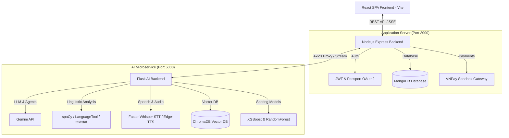

# 🎓 IELTS Learning & Practice Platform - Hybrid AI & Multi-Agent System

[](https://github.com/phuccka12/DoanThuctap)
[](https://mongodb.com)
[](https://ai.google.dev)
[](https://opensource.org/licenses/ISC)
[](#)

A comprehensive, state-of-the-art IELTS preparation and adaptive learning platform. It leverages Generative AI (LLM), standard NLP pipelines, and gamification to personalize student roadmaps, provide detailed writing/speaking band evaluations, and incentivize studying through a Virtual Pet system.

---

## 🏗️ System Architecture

The application implements a separated **3-Tier Multi-Service Architecture**:



---

## 🚀 Core Features

### 1. 🎤 AI Speaking Practice & Conversation
*   **Speech Evaluation:** Uses **OpenAI Whisper** for high-accuracy speech-to-text, scoring pronunciation, fluency, vocabulary, and grammar.
*   **AI Oral Chat:** Enables 1-1 conversation practice with natural human voices generated in real-time via **Edge-TTS** (UK/US accents).

### 2. ✍️ AI Writing Evaluation (PRO)
*   **Async Task Processing:** An asynchronous queuing pipeline that processes essay grading, avoiding browser timeout errors.
*   **Linguistic Feedback:** Calculates grammatical mistakes (LanguageTool), lexical diversity (TTR score), band estimates, and streams detailed model essays dynamically to the user.

### 3. 🤖 AI Agentic Content Engine (Reading Passage Generator)
*   **Architect Agent:** Analyzes the desired topic and compiles structural learning objectives.
*   **Author Agent:** Generates reading passages matched to target CEFR levels (A1-C2).
*   **Critic Agent:** Programmatically audits output parameters (Flesch readability score, lexical diversity, word counts, and structural integrity).
*   **Self-Correction Loop:** Automatically prompts the Author to rewrite if critic requirements fail (up to 5 attempts).

### 4. 🦖 Virtual Pet Ecosystem & Economy
*   **Gamified Growth:** Connects progress directly to a virtual pet. Happy/Neutral states reward players with **EXP & Coin Multipliers**, while a *Dying* pet locks all item/resource gains until healed.
*   **Item Shop:** Spend study-earned coins to purchase food, customized skins, and reviving potions.

### 5. 💳 Subscriptions & Billing
*   **Feature Gating:** Three membership tiers (Free, Basic, Premium) enforced dynamically via backend route middleware.
*   **VNPay Sandbox Integration:** Implements secure SHA512 transaction hashes, real-time IPN webhook callbacks, and node-cron auto-expiration checks.

---

## 📂 Project Structure

```text
Doantotnghiep/
├── client-web/                 # React SPA Frontend (Vite & TailwindCSS)
│   ├── src/
│   │   ├── components/         # Reusable Widgets (Pet indicators, Modals, Timelines)
│   │   ├── pages/              # Main App views (Lobby, Speaking, Writing, Admin)
│   │   └── services/           # Axios REST and SSE network adapters
│
├── server/                     # Node.js Express Gateway & Application Server
│   ├── scripts/                # Database diagnostic & audit utilities
│   ├── src/
│   │   ├── controllers/        # Business logic & AI proxies
│   │   ├── models/             # Mongoose schemas (Users, Pets, Plans, Subs, Transactions)
│   │   └── routes/             # REST route mapping
│
└── server/python_ai/           # Flask AI Service (NLP & Speech Processing)
    ├── app.py                  # API endpoints definition
    └── requirements.txt        # Python external dependencies
```

---

## 🛠️ Installation & Setup

### Prerequisites
*   **Node.js (v18+)**
*   **Python (3.9 - 3.11)**
*   **MongoDB (Local or Atlas)**
*   **FFmpeg** (added to your system PATH)

---

### Step 1: Backend Node.js Setup
1.  Navigate into `server`:
    ```bash
    cd server
    npm install
    ```
2.  Create `.env` file from `.env.example`:
    ```env
    PORT=3000
    MONGO_URI=mongodb://127.0.0.1:27017/ielts-app
    JWT_SECRET=your_jwt_secret
    # Cloudinary, Mail, and VNPay configurations
    AI_SERVICE_URL=http://127.0.0.1:5000
    ```
3.  Seed initial database data:
    ```bash
    npm run seed
    ```
4.  Launch the backend server:
    ```bash
    npm run dev
    ```

---

### Step 2: Python AI Microservice Setup
1.  Navigate into `server/python_ai`:
    ```bash
    cd server/python_ai
    ```
2.  Set up and activate a virtual environment:
    ```bash
    # Windows
    python -m venv venv
    .\venv\Scripts\Activate.ps1
    
    # macOS/Linux
    python3 -m venv venv
    source venv/bin/activate
    ```
3.  Install dependencies and download the spaCy language corpus:
    ```bash
    pip install -r requirements.txt
    python -m spacy download en_core_web_md
    ```
4.  Configure `.env`:
    ```env
    GEMINI_API_KEY=AIzaSy...YourKey
    ```
5.  Run the Flask application:
    ```bash
    python app.py
    ```
    *Ensure logs output: `✅ TOÀN BỘ HỆ THỐNG ĐÃ SẴN SÀNG CHIẾN ĐẤU!`*

---

### Step 3: Frontend Client Setup
1.  Navigate into `client-web`:
    ```bash
    cd client-web
    npm install
    ```
2.  Start the Vite dev server:
    ```bash
    npm run dev
    ```
3.  Open [http://localhost:5173](http://localhost:5173) in your browser.

---

## 📄 License
This project is released under the **ISC License**. Refer to `package.json` for details.
